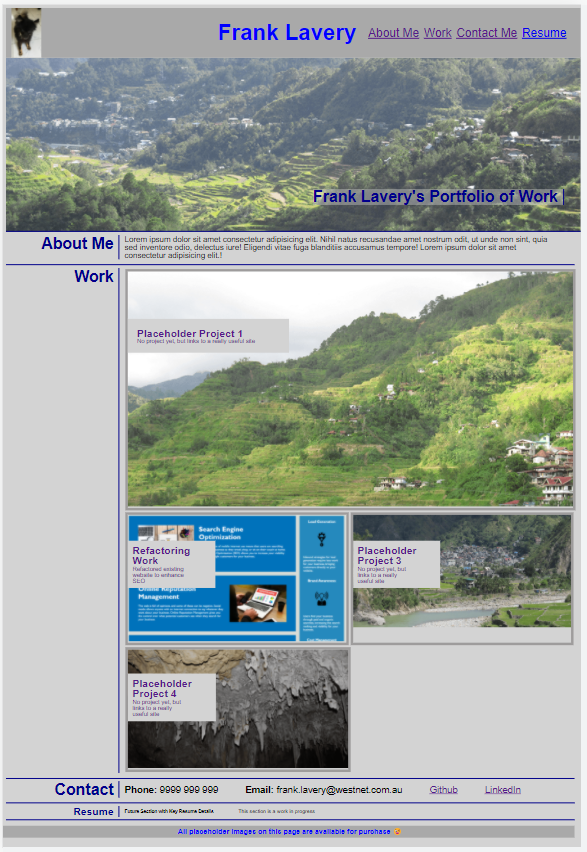

# Project Portfolio
Portfolio of a candidate employee's project work.

## Description
The webpage sets out a portfolio of work for use by employers' in assessing the suitability of the owner to fill a role.

It provides some basic information about the candidate, links and screenshots of projects that the candidate has either worked on or completed, along with contact information for the candidate, including links to Github and LinkedIn.  A section at the bottom has been provided to allow the employment history of the candidate to be added at a later stage.

 The webpage uses a flexbox layout to present the projects.  The flagship project is presented in a larger format than the other projects.  At this point in time, placeholders and links to useful websites have been used pending the completion of further projects.  It is designed so that projects can be updated or additional projects added at any time within the HTML, without needing to change the CSS.

 The webpage uses media queries to respond to different size screens.

 Current plans are that the owner will use the portfolio for his own purposes, making updates and improvements over the next few months, as considered appropriate.

## Usage
The webpage is located at this address:  https://cancer2806.github.io/Project-Portfolio/

A screenshot of the webpage is provided below:

CSS is contained in one file:  ./assets/css/style.css

Images are all contained in a local directory:  ./assets/images/

## Credits
Repository for the submission of Week 2's Homework in UWA's Bootcamp series

## License
This repo is to be used only for determining the suitability of the owner for employment or engagement in a project or other enterprise
